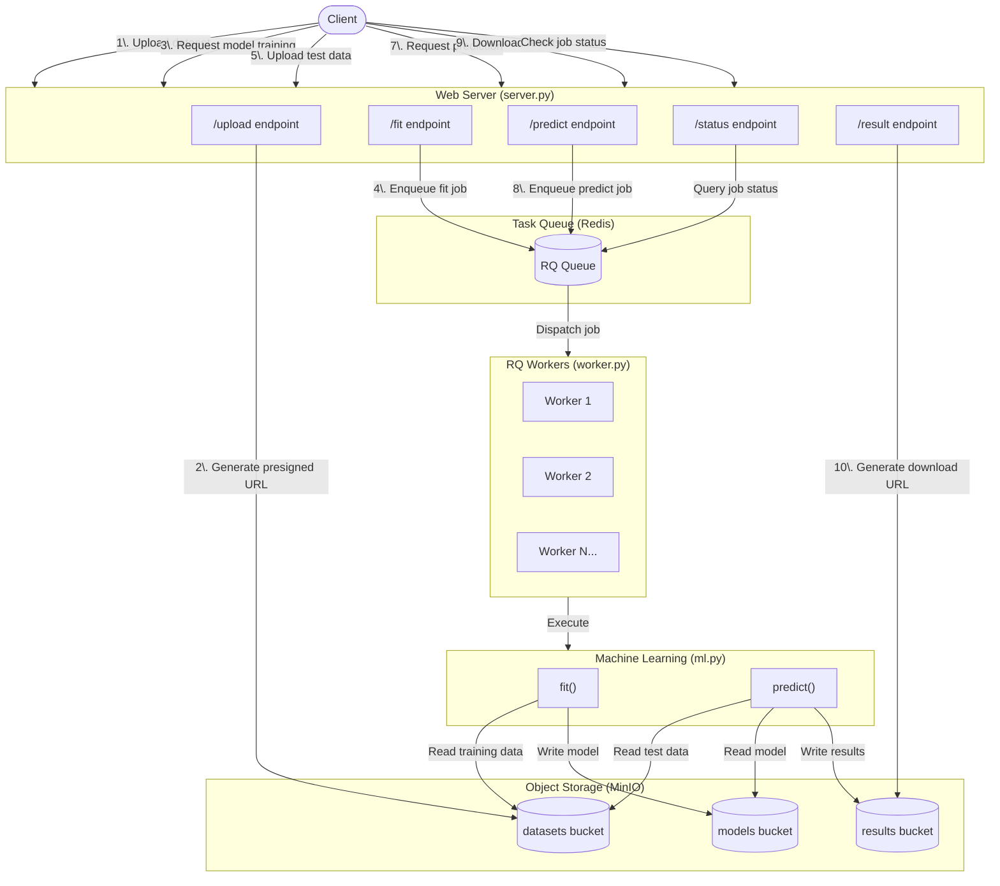

# neuralk-technical-assessment

[](https://github.com/rafikbahri/neuralk-technical-assessment/actions/workflows/ci.yml)

Neuralk AI Technical Assessment - DevOps / SRE

## Introduction

This project is a technical assessment for Neuralk AI, focusing on DevOps and SRE practices.
See technical assessment details in the [TA.md](TA.md).

The app implements a machine learning API service that allows users to:

1. Upload datasets
2. Train models on those datasets
3. Make predictions using trained models
4. Download prediction results

The application consists of the following components:

- A web server (`server.py`) that handles API requests
- MinIO object storage for datasets, models, and results
- Redis and RQ for task queueing and processing
- RQ workers that execute the machine learning tasks
- ML functions (`ml.py`) containing the core functionality for model training and prediction
- A client interface (`client.py`) for interacting with the API

Example workflows are provided in `example_1.py` (complete training and prediction workflow) and `example_2.py` (parallel model training).

## Architecture Diagram



## Configuration with .env Files

The project uses dotenv files for configuration. To set up your environment:

1. Create a `.env` file, if not already present:

   ```bash
   cp .env.example .env
   ```

2. Edit the `.env` file with your specific settings:
   - Server configuration (host, port)
   - Redis connection settings
   - MinIO configuration
   - Logging preferences
   - Queue settings

You can also create a `.env.local` file for overrides that shouldn't be committed to version control.

Available configuration options:

| Variable | Description | Default |
|----------|-------------|---------|
| SERVER_HOST | Host for the web server | localhost |
| SERVER_PORT | Port for the web server | 8088 |
| REDIS_HOST | Redis server host | localhost |
| REDIS_PORT | Redis server port | 6379 |
| REDIS_DB | Redis database number | 0 |
| REDIS_PASSWORD | Redis password (if required) | None |
| MINIO_HOST | MinIO server host and port | localhost:8088 |
| MINIO_ACCESS_KEY | MinIO access key | minioadmin |
| MINIO_SECRET_KEY | MinIO secret key | minioadmin |
| MINIO_SECURE | Whether to use HTTPS for MinIO | False |
| MINIO_PROXY_ADDRESS | Address for client to access MinIO (for presigned URLs) | localhost |
| MINIO_PROXY_PORT | Port for client to access MinIO (for presigned URLs) | 8088 |
| MINIO_PROXY_PATH | Path prefix for MinIO when behind a proxy | /minio |
| LOG_LEVEL | Logging level (DEBUG, INFO, WARNING, ERROR, CRITICAL) | INFO |
| JOB_TIMEOUT | RQ job timeout | 600s |
| MAX_RETRIES | Maximum retries for failed jobs | 4 |
| QUEUE_NAME | Name of the RQ queue | default |

## Docker Setup

This project includes Docker Compose configuration for running the required services. The Docker Compose setup includes:

- **Redis**: For job queue management
- **Redis Commander**: Web UI for Redis monitoring and management
- **MinIO**: For object storage (datasets, models, results)
- **Init Minio**: Job to initialize MinIO buckets
- **Server**: API server that handles client requests
- **Worker**: For processing ML tasks in the background
- **Envoy**: Unified API gateway for all services

To run the complete stack with Docker Compose, run:

```bash
docker-compose up -d --build
```

## Envoy API Gateway

The project uses Envoy as an API gateway to provide unified access to all services through a single endpoint. All services are accessible through `http://localhost:8088` with different path prefixes:

| Service | Access URL | Description |
|---------|------------|-------------|
| Server API | `http://localhost:8088/` | Main API endpoints |
| MinIO API | `http://localhost:8088/minio/` | MinIO object storage API |
| MinIO Console | `http://localhost:8088/minio-console/` | MinIO web console |
| Redis Commander | `http://localhost:8088/redis/` | Redis web UI |
| Envoy Admin | `http://localhost:9901/` | Envoy administration interface |

This unified access pattern simplifies service discovery and interaction, especially for client applications that need to communicate with multiple services.

In this setup, you need to add the following line to your `/etc/hosts/`, in order for the client to be able to resolve `minio` and use the presigned URLs.

```bash
127.0.0.1 minio
```

Read more about Minio presigned URL issue [here](https://github.com/minio/minio/issues/8007).

To be able to run the python modules, you need to export the python path:

```bash
export PYTHONPATH=$(pwd)
```

## Kubernetes Setup

For production deployments, the project includes Kubernetes manifests for deploying all components to a Kubernetes cluster. The manifests are located in the `deploy/kube` directory and include:

- Namespace and configuration
- Redis deployment
- MinIO object storage
- API server
- ML workers with autoscaling

For detailed instructions on Kubernetes deployment, see [deploy/kube/README.md](deploy/kube/README.md).

## Helm Chart

For easier deployment and management of the application across different environments, a Helm chart is provided in the `deploy/helm/neuralk` directory.

### Installation

```bash
# For development environment
helm install neuralk ./deploy/helm/neuralk -f deploy/helm/neuralk/values-dev.yaml --create-namespace -n neuralk-dev
```

For more details on the Helm chart, see [deploy/helm/neuralk/README.md](deploy/helm/neuralk/README.md).
