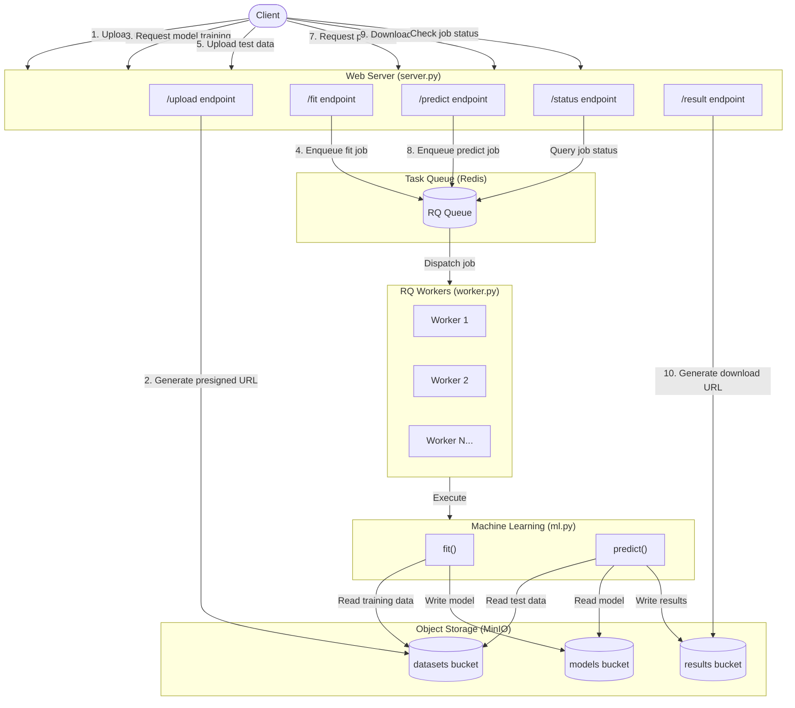

# neuralk-technical-assessment

Neuralk AI Technical Assessment - DevOps / SRE

## Architecture Diagram



## Project Description

This project implements a machine learning API service that allows users to:

1. Upload datasets
2. Train models on those datasets
3. Make predictions using trained models
4. Download prediction results

The application consists of the following components:

- A web server (`server.py`) that handles API requests
- MinIO object storage for datasets, models, and results
- Redis and RQ for task queueing and processing
- RQ workers that execute the machine learning tasks
- ML functions (`ml.py`) containing the core functionality for model training and prediction
- A client interface (`client.py`) for interacting with the API

Example workflows are provided in `example_1.py` (complete training and prediction workflow) and `example_2.py` (parallel model training).

## Configuration with .env Files

The project uses dotenv files for configuration. To set up your environment:

1. Create a `.env` file, if not already present:

   ```bash
   cp .env.example .env
   ```

2. Edit the `.env` file with your specific settings:
   - Server configuration (host, port)
   - Redis connection settings
   - MinIO configuration
   - Logging preferences
   - Queue settings

You can also create a `.env.local` file for overrides that shouldn't be committed to version control.

Available configuration options:

| Variable | Description | Default |
|----------|-------------|---------|
| SERVER_HOST | Host for the web server | localhost |
| SERVER_PORT | Port for the web server | 8080 |
| REDIS_HOST | Redis server host | localhost |
| REDIS_PORT | Redis server port | 6379 |
| REDIS_DB | Redis database number | 0 |
| REDIS_PASSWORD | Redis password (if required) | None |
| MINIO_HOST | MinIO server host and port | localhost:9000 |
| MINIO_ACCESS_KEY | MinIO access key | minioadmin |
| MINIO_SECRET_KEY | MinIO secret key | minioadmin |
| MINIO_SECURE | Whether to use HTTPS for MinIO | False |
| LOG_LEVEL | Logging level (DEBUG, INFO, WARNING, ERROR, CRITICAL) | INFO |
| JOB_TIMEOUT | RQ job timeout | 600s |
| MAX_RETRIES | Maximum retries for failed jobs | 4 |
| QUEUE_NAME | Name of the RQ queue | default |
