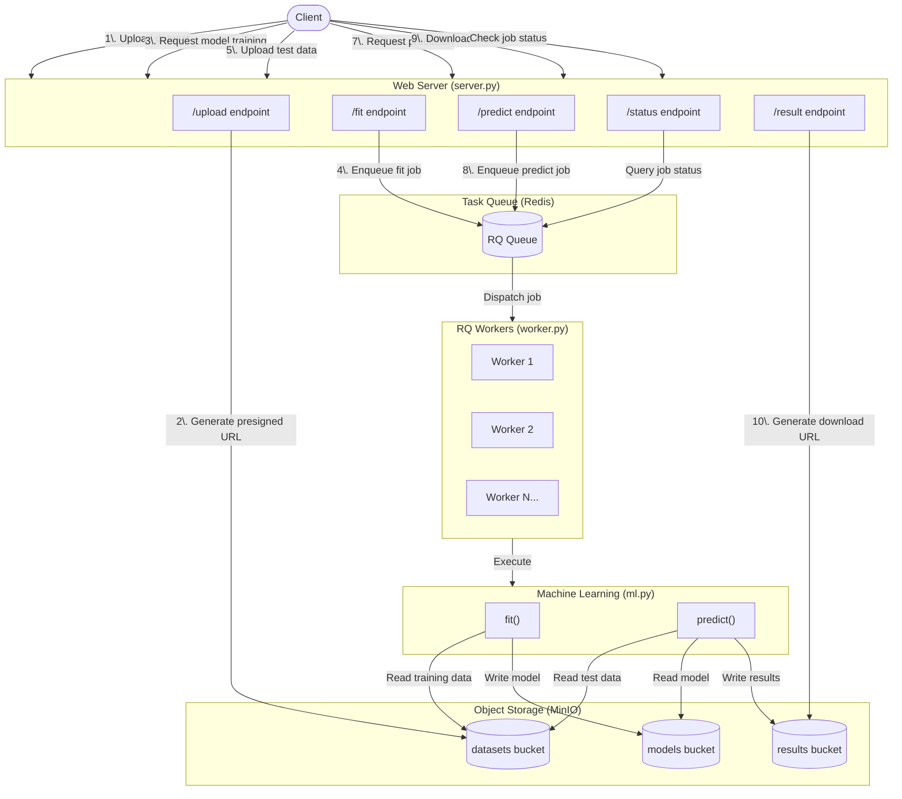

# Project Architecture

## Introduction

This project is a technical assessment for Neuralk AI, focusing on DevOps and SRE practices.
See technical assessment details in the [technical assessment](../ta.md).

The app implements a machine learning API service that allows users to:

1. Upload datasets
2. Train models on those datasets
3. Make predictions using trained models
4. Download prediction results

The application consists of the following components:

- A web server (`server.py`) that handles API requests
- MinIO object storage for datasets, models, and results
- Redis and RQ for task queueing and processing
- RQ workers that execute the machine learning tasks
- ML functions (`ml.py`) containing the core functionality for model training and prediction
- A client interface (`client.py`) for interacting with the API

Example workflows are provided in `example_1.py` (complete training and prediction workflow) and `example_2.py` (parallel model training).

## Architecture Diagram

